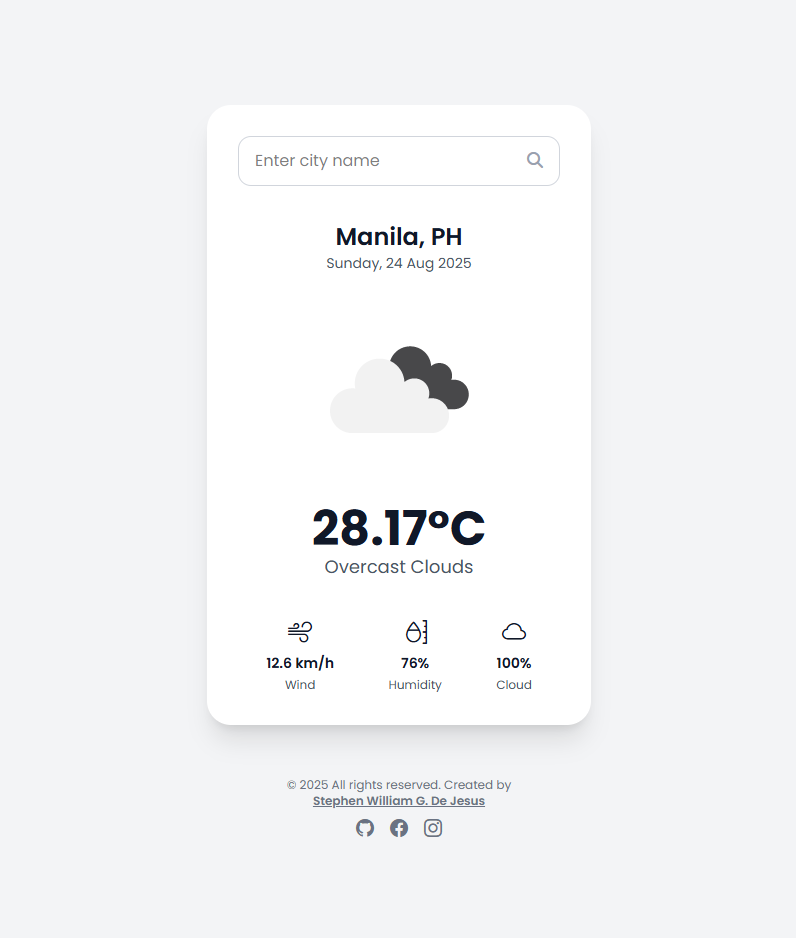
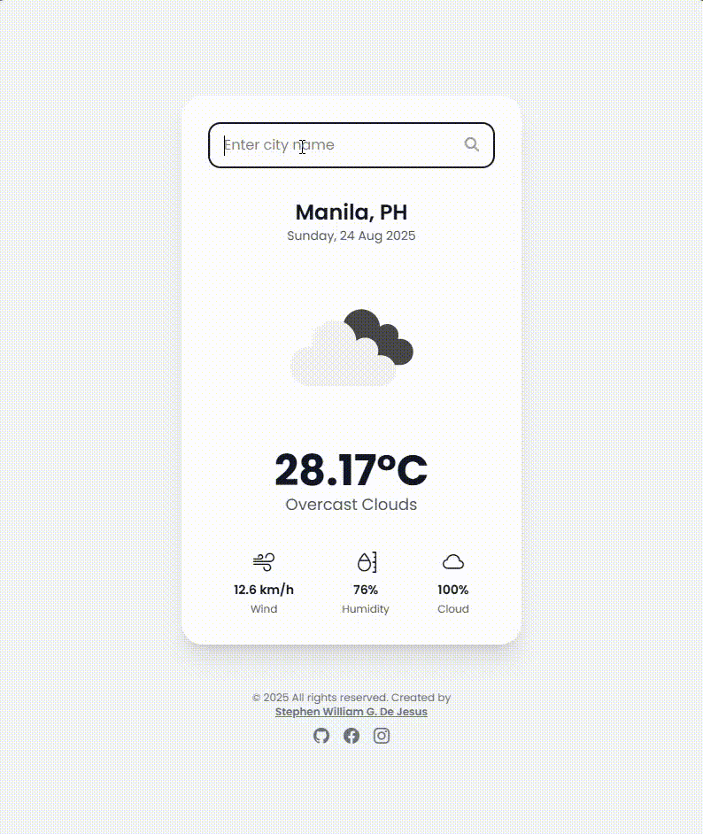

# 🌤️ Weather App — Real-Time Weather Information

A modern, responsive, and accessible weather application built with **HTML5**, **Tailwind CSS**, and **JavaScript**.  
Get real-time weather information for any city worldwide with an intuitive interface and smart notifications.

Crafted by **[Stephen William G. De Jesus](https://www.facebook.com/stephenwilliam.dejesus.5/)**, this project demonstrates API integration, dynamic content rendering, and responsive design using Tailwind CSS.

🌐 Live Demo: [View Live Demo](https://bogiiiie.github.io/20-javascript-weather-app/)

---

## 📸 Preview  

### 🖼️ Application Screenshot  


### 🎞️ Live Interaction (GIF)  



## ✨ Features

- 🔍 **City Search** – Search weather for any city worldwide with validation
- 🌡️ **Real-Time Data** – Current temperature, humidity, wind speed, and conditions
- 🎨 **Weather Icons** – Visual weather condition indicators
- 🔔 **Smart Notifications** – Loading states, success messages, and error handling
- 📅 **Current Date** – Always shows today's date with proper formatting
- 📱 **Responsive Design** – Works perfectly on desktop, tablet, and mobile
- ♿ **Accessibility Ready** – ARIA labels, semantic HTML, and screen reader support
- ⚡ **Fast Loading** – Efficient API calls with error boundaries
- 🎯 **Input Validation** – Real-time feedback for user interactions
- 🌐 **Global Coverage** – Weather data for cities in any country

---

## 🖥️ How to Use

1. **Default Location** – App loads with Manila, Philippines weather data
2. **Search City** – Type any city name in the search box
3. **Get Weather** – Press Enter or click the search icon
4. **View Details** – See temperature, humidity, wind speed, and cloud coverage
5. **Visual Feedback** – Receive notifications for all interactions

---

## 🛠️ Built With

- [HTML5](https://developer.mozilla.org/en-US/docs/Web/Guide/HTML/HTML5) – Semantic structure with accessibility
- [Tailwind CSS](https://tailwindcss.com/) – Utility-first styling framework
- [JavaScript ES6+](https://developer.mozilla.org/en-US/docs/Web/JavaScript) – Modern vanilla JavaScript with async/await
- [OpenWeatherMap API](https://openweathermap.org/api) – Weather data provider
- [Font Awesome](https://fontawesome.com/) – Icons for notifications and UI
- [Bootstrap Icons](https://icons.getbootstrap.com/) – Weather and interface icons
- [Google Fonts (Poppins)](https://fonts.google.com/specimen/Poppins) – Modern typography

---

## 📁 Project Structure

```
20-javascript-weather-app/
├── index.html              # Main HTML structure with SEO optimization
├── script.js               # Core JavaScript functionality and API integration
├── output.css              # Compiled Tailwind CSS styles
└── images/
    ├── demo.png           # Application screenshot
    └── demo.gif           # Demo animation
```

---

## 🚀 Getting Started

To run this project locally:

```bash
git clone https://github.com/bogiiiie/20-javascript-weather-app.git
cd 20-javascript-weather-app
```

### API Key Setup
1. Sign up at [OpenWeatherMap](https://openweathermap.org/api)
2. Get your free API key
3. Replace the API key in `script.js`:
```javascript
const API_KEY = "your_api_key_here";
```

### Launch Application
```bash
open index.html
```

**No build process required** – Just open `index.html` in your browser!

---

## 🎯 Core Functions

- `getCityCoordinates(city, apiKey)` – Fetches city coordinates with error handling
- `getWeather(lat, lon)` – Retrieves weather data from OpenWeatherMap API
- `displayWeather(cityName, apiKey)` – Main function that orchestrates data flow
- `showNotification(message, type)` – Professional notification system
- `updateUI()` – Dynamic content rendering with accessibility features
- `validateInput()` – Real-time input validation with visual feedback

---

## ♿ Accessibility Features

- **ARIA Labels** – Dynamic labels that update with weather data
- **Semantic HTML** – Proper heading hierarchy and landmark roles
- **Screen Reader Support** – Descriptive text for all weather information
- **Keyboard Navigation** – Full keyboard support for search functionality
- **Focus Management** – Clear focus indicators and logical tab order
- **Skip Navigation** – Direct access to main content for screen readers
- **Image Alt Text** – Descriptive alternative text for weather icons

---

## 📱 Responsive Design

- **Mobile-First** – Optimized for smartphones and tablets
- **Flexible Layout** – Adapts to any screen size (320px to 2560px+)
- **Touch-Friendly** – Appropriately sized tap targets
- **Readable Typography** – Scalable fonts and proper contrast ratios
- **Efficient Loading** – Optimized for mobile networks

---

## 🌐 API Integration

- **OpenWeatherMap API** – Reliable weather data source
- **Geocoding API** – Converts city names to coordinates
- **Current Weather API** – Real-time weather conditions
- **Error Handling** – Graceful handling of network issues
- **Rate Limiting** – Efficient API usage to prevent rate limiting

---

## 🔧 Technical Features

- **Async/Await** – Modern JavaScript for API calls
- **Error Boundaries** – Comprehensive error handling with user feedback
- **Input Debouncing** – Prevents excessive API calls during typing
- **Dynamic Content** – Real-time UI updates with weather data
- **SEO Optimized** – Meta tags, structured data, and semantic HTML
- **Performance Optimized** – Fast loading with efficient resource usage

---

## 🔔 Notification System

- **Loading States** – Visual feedback during API calls
- **Success Messages** – Confirmation when weather data loads
- **Error Handling** – Clear error messages for invalid cities or network issues
- **Input Validation** – Warnings for invalid input patterns
- **Professional Design** – Clean notifications with FontAwesome icons

---

## 🔧 Troubleshooting

### Common Issues

- **API Key Error:** Ensure your OpenWeatherMap API key is valid and active
- **City Not Found:** Check spelling and try alternative city names
- **Network Issues:** Verify internet connection and API service status
- **Styles Not Loading:** Ensure `output.css` is in the same directory

### Browser Support

- **Modern Browsers:** Chrome 60+, Firefox 55+, Safari 12+, Edge 79+
- **Mobile Browsers:** iOS Safari 12+, Chrome Mobile 60+
- **API Requirements:** Browsers supporting Fetch API and ES6+ features

---

## 👨‍💻 Author

**Stephen William G. De Jesus**

- 🌐 **Facebook:** [Stephen William De Jesus](https://www.facebook.com/stephenwilliam.dejesus.5/)
- 💻 **GitHub:** [@bogiiiie](https://github.com/bogiiiie)
- 📸 **Instagram:** [@stephenwilliamdejesus](https://www.instagram.com/stephenwilliamdejesus/)

---

## 📄 License

© 2025 All rights reserved. Created by Stephen William G. De Jesus.

---

## 🚀 Future Enhancements

- 📅 **7-Day Forecast** – Extended weather predictions with daily breakdown
- 📍 **Geolocation** – Automatic weather for user's current location  
- 🌍 **Weather Maps** – Interactive maps with weather overlays
- 🌙 **Dark Mode** – Toggle between light and dark themes
- ⭐ **Favorite Cities** – Save and quickly access preferred locations
- 🚨 **Weather Alerts** – Notifications for severe weather conditions
- 🌡️ **Unit Conversion** – Switch between Celsius/Fahrenheit and metric/imperial
- 📊 **Weather History** – Historical weather data and trends
- 📱 **PWA Support** – Install as a native-like mobile app
- 🔄 **Auto Refresh** – Periodic weather updates in the background

---
